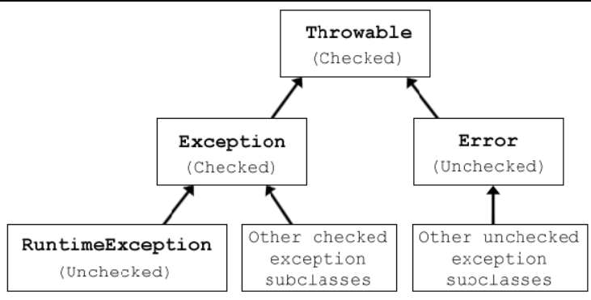

# 异常处理
在开发使用中，异常能够很好地帮助开发者定位到问题的所在。而如果使用一种错误的方式，则bug很难被找到

## 异常的分类

JAVA中有三种一般类型的可抛类：检查性异常(checked exceptions)、非检查性异常(unchecked Exceptions) 和 错误(errors)

1. Checked exceptions：必须通过方法进行声明。这些异常都继承自Exception 类。一个Checked exception 声明了一些预期可能发生的异常

2. Unchecked exceptions：不需要声明的异常。大多继承自RuntimeException。例如NullPointerException， ArrayOutOfBoundsException。同时这样的异常不应该捕获，而应该打印出堆栈信息

3. Errors：大多是一些运行环境的问题，这些问题可能会导致系统无法运行。例如OutOfMemoryError，StackOverflowError



## 用户自定义异常
开发者该遵循如下的规范

1. 当应用程序出现问题时，直接抛出自定义异常
```java
throw new DaoObjectNotFoundException("Couldn't find dao with id " + id);
```

2. 将自定义异常中的原始异常包装并抛出
```java
catch (NoSuchMethodException e) {
throw new DaoObjectNotFoundException("Couldn't find dao with id " + id, e);
}
```

3. 不要截留下catch的异常

4. 方法上应该抛出具体的异常。而不是Exception

5. 要捕获异常的子类，而不是直接捕获Exception

6. 永远不要捕获Throwable类
> 这是一个更严重的麻烦。 因为java错误也是Throwable的子类。 错误是JVM本身无法处理的不可逆转的条件。 对于某些JVM的实现，JVM可能实际上甚至不会在错误上调用catch子句
7. 不要只是抛出一个新的异常，而应该包含堆栈信息

8. 要么记录异常要么抛出异常，但不要一起执行

9. 不要在finally 中再抛出异常

10. 始终只捕获实际可处理的异常
> 不要为了捕捉异常而捕捉，只有在想要处理异常时才捕捉异常

11. 不要使用printStackTrace()语句或类似的方法

12. 如果你不打算处理异常，请使用finally块而不是catch块

13. 应该尽快抛出(throw)异常，并尽可能晚地捕获(catch)它
> 编码时，应该尽早抛出异常，并在有足够信息后再捕获异常进行妥善处理
> 如果有些异常暂时无法处理，不要为了catch 而catch，而应该继续 throw

14. 在捕获异常之后，需要通过finally 进行收尾;在使用io或者数据库连接等，最终需要去关闭并释放它

15. 不要使用if-else 来控制异常的捕获

16. 一个异常只能包含在一个日志中

17. 将所有相关信息尽可能地传递给异常,有用且信息丰富的异常消息和堆栈跟踪也非常重要

18. 在JavaDoc中记录应用程序中的所有异常,应该用javadoc 来记录为什么定义这样一个异常

19. 异常应该有具体的层次结构,如果异常没有层次的话，则很难管理系统中异常的依赖关系
```java
class Exception {}
class BusinessException extends Exception {}
class AccountingException extends BusinessException {}
class BillingCodeNotFoundException extends AccountingException {}
class HumanResourcesException extends BusinessException {}
class EmployeeNotFoundException extends HumanResourcesException {}
```
